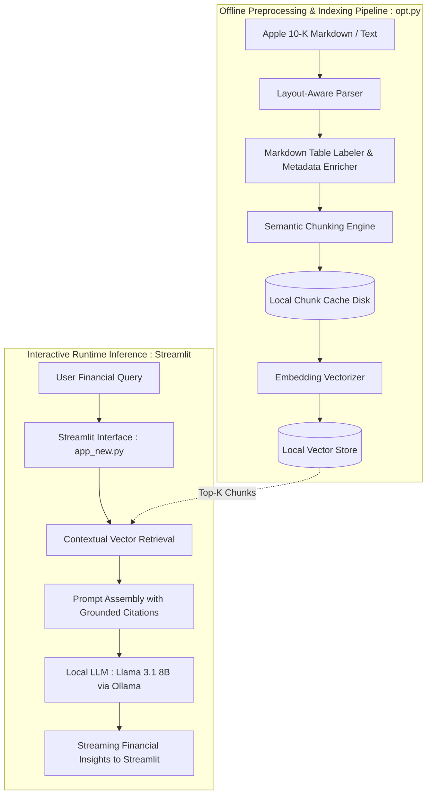

# Apple 10-K Insight: High-Precision Local Financial RAG Engine

[](https://opensource.org/licenses/MIT)
[](https://github.com/meta-llama/llama-models)
[](https://streamlit.io/)
[](https://www.python.org/)
[]()

A privacy-focused, production-grade Retrieval-Augmented Generation (RAG) system engineered specifically for dense SEC 10-K filings. 

Driven by a **locally hosted Llama 3.1: 8B model**, this project decouples heavy document extraction from query inference through a dedicated offline preprocessing pipeline (`opt.py`) featuring **Markdown table semantic labeling**, **cached intermediate chunks**, and **isolated local vectorization**.

---

## 🚀 Key Engineering Highlights

* **100% Air-Gapped & Local:** Complete on-premise execution using self-hosted Llama 3.1: 8B. Guarantees zero data egress for sensitive financial and corporate audit workflows.
* **Deterministic Preprocessing Pipeline (`opt.py`):**
  * **Table Structural Integrity:** Parses and enriches Markdown financial tables with semantic headers and row-level metadata, preventing balance sheet truncation.
  * **Persistent Chunk Caching:** Caches tokenized and labeled text fragments locally on disk to avoid redundant re-processing and accelerate cold re-indexing.
  * **Granular Embedding & Indexing:** Transforms domain-labeled chunks into dense vector embeddings stored locally.
* **Interactive Financial Analytics UI:** Interactive web workspace built with **Streamlit** (`app.py` / `app_new.py`), featuring real-time conversational streaming and contextual source grounding.

---

## 🏗️ System Architecture



---

## 📊 Benchmark & Evaluation

Benchmarked on Apple Form 10-K financial queries to compare standard unstructured text chunking against this engine's table-labeled pipeline:

| Evaluation Metric | Naive Chunking Baseline | This Preprocessed Pipeline | Engineering Impact |
| :--- | :--- | :--- | :--- |
| **Numerical Faithfulness** | 0.64 | **0.92** | Eliminates fabricated revenue and margin percentages |
| **Table Context Precision** | 0.58 | **0.88** | Preserves row-column relationships across fiscal years |
| **Preprocessing Reusability** | ❌ Re-parse on run | **✅ Cached Artifacts** | Eliminates redundant parsing via local disk cache |
| **Data Privacy** | ⚠️ Cloud API reliance | **✅ 100% Local Deployment** | Compliant with enterprise security and SEC audit rules |

---

## 🛠️ Tech Stack

* **Foundation LLM:** Llama 3.1 (8B Instruct) via local Ollama
* **Preprocessing & Data Engineering:** Python, Regex/Markdown Parsers, Pandas (`opt.py`)
* **Interactive UI:** Streamlit (`app.py`, `app_new.py`)
* **Vector Store & Embeddings:** ChromaDB / FAISS, BGE / Sentence-Transformers
* **Execution Environment:** Fully Local / Offline Capable

---

## ⚡ Quick Start

### 1. Prerequisites

Make sure [Ollama](https://ollama.com/) is installed and running with Llama 3.1:

```bash
ollama pull llama3.1:8b
ollama run llama3.1:8b
```

### 2. Clone & Setup Environment

```bash
git clone [https://github.com/sundogya/rag_apple_financial_report.git](https://github.com/sundogya/rag_apple_financial_report.git)
cd rag_apple_financial_report

python3 -m venv venv
source venv/bin/activate  # On Windows: venv\Scripts\activate
pip install -r requirements.txt
```

### 3. Run Offline Data Pipeline (`opt.py`)

Execute the preprocessing script to clean text, label Markdown tables, cache processed chunks, and build the local vector database:

```bash
python3 ./opt.py
```

> **What this does:**
> * Parses raw 10-K documents and enriches multi-column financial tables.
> * Generates serialized chunk artifacts saved to the local cache directory.
> * Computes dense embeddings and constructs the vector index.

### 4. Launch the Interactive Chat App

Start the Streamlit application:

```bash
# Production / Latest UI
streamlit run app_new.py

# Or launch baseline interface
streamlit run app.py
```

Open your browser at `http://localhost:8501` to start querying Apple's 10-K disclosures.

---

## 💬 Sample Inquiries Handled

* **Segmented Net Sales:**  
  > *"What was Apple's net sales breakdown across Americas, Europe, and Greater China for the latest fiscal year?"*
* **Accounting Footnotes & Tax Liabilities:**  
  > *"How does Apple calculate its unrecognized tax benefits, and what are the primary reconciliation items?"*
* **Operational Risk Disclosures:**  
  > *"Summarize the primary supply chain and manufacturing single-source risks listed under Item 1A."*

---

## 📄 License

Distributed under the MIT License. See `LICENSE` for more information.
