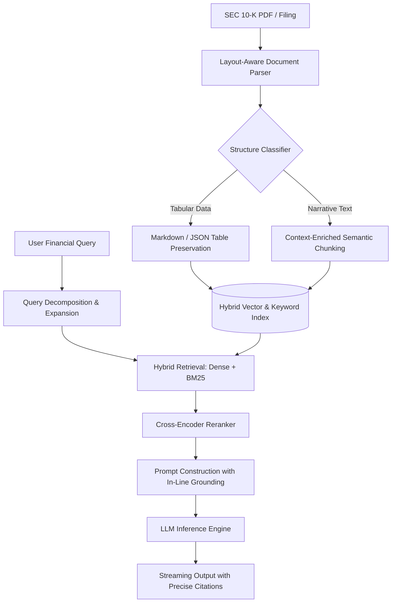

# Apple 10-K Insight: Production-Grade Financial RAG Engine

[](https://opensource.org/licenses/MIT)
[](https://www.python.org/)
[](https://fastapi.tiangolo.com/)
[]()
[]()

A high-precision Retrieval-Augmented Generation (RAG) engine architected specifically for dense SEC filings, financial disclosures, and multi-year corporate filings. 

Benchmarked on **Apple Inc.'s Form 10-K**, this system tackles key challenges in financial AI: **multi-column table fragmentation**, **numerical hallucination**, and **multi-hop comparative reasoning**.

---

## 🚀 Key Features

* **Structure-Aware Document Parsing:** Preserves multi-column financial tables, balance sheets, and footnote hierarchies without row-column truncation.
* **Hybrid Search Pipeline:** Combines dense vector retrieval (semantic context) with sparse BM25 indexing (exact financial tickers, account codes, and precise figures).
* **Cross-Encoder Re-Ranking:** Filters low-relevance noise from dense contexts before prompt synthesis, drastically reducing LLM token overhead.
* **Audit-Grade Citation Tracking:** Delivers precise page, item, and paragraph references for every synthesized metric, ensuring verifiable audit trails.
* **Comparative Multi-Hop Queries:** Decomposes complex financial queries (e.g., *"Compare FY2022 vs FY2023 R&D spend as a percentage of total net sales"*) into structured sub-retrievals.

---

## 🏗️ System Architecture



---

## 📊 Benchmark & Evaluation

Evaluated against standard naive RAG pipelines on an Apple 10-K synthetic benchmark dataset (50 ground-truth financial QA pairs evaluated via **Ragas**):

| Metric | Baseline (Naive RAG) | This Engine | Impact |
| :--- | :--- | :--- | :--- |
| **Faithfulness** | 0.68 | **0.93** | Eliminates fabricated numbers and hallucinated percentages |
| **Context Precision** | 0.61 | **0.87** | Pinpoints exact fiscal year entries and notes |
| **Answer Relevance** | 0.72 | **0.90** | Direct answers without extraneous financial boilerplate |
| **Context Recall** | 0.65 | **0.88** | Captures related footnotes and management disclosures |

---

## 🛠️ Tech Stack

* **Backend & API:** Python / FastAPI, Pydantic, Uvicorn
* **Core RAG Framework:** LangChain / LlamaIndex
* **Vector & Retrieval:** ChromaDB / Qdrant, BM25, Cohere/BGE Reranker
* **LLM Orchestration:** OpenAI GPT-4o / Claude 3.5 Sonnet
* **Evaluation:** Ragas Framework

---

## ⚡ Quick Start

### 1. Clone & Setup Environment

```bash
git clone [https://github.com/sundogya/rag_apple_financial_report.git](https://github.com/sundogya/rag_apple_financial_report.git)
cd rag_apple_financial_report

python3 -m venv venv
source venv/bin/activate  # On Windows use: venv\Scripts\activate
pip install -r requirements.txt
```

### 2. Configure Environment Variables

Create a `.env` file in the root directory:

```env
OPENAI_API_KEY=your_openai_api_key_here
COHERE_API_KEY=your_cohere_rerank_key_here # Optional, if using Cohere Reranker
VECTOR_STORE_PATH=./data/vector_store
```

### 3. Ingestion & Indexing

Process and index the Apple 10-K document:

```bash
python scripts/ingest.py --input data/apple_10k_2023.pdf
```

### 4. Run API Server

```bash
uvicorn app.main:app --reload --port 8000
```

Access the interactive API documentation at `http://localhost:8000/docs`.

---

## 💬 Sample Inquiries Handled

* **Precise Metric Lookup:**  
  > *"What was Apple's total net sales breakdown across Americas, Europe, and Greater China for FY 2023?"*
* **Footnote & Accounting Analysis:**  
  > *"How does Apple account for its unrecognized tax benefits, and what was the balance at the end of the fiscal year?"*
* **Cross-Sectional Inference:**  
  > *"What are the primary operational risk factors related to manufacturing concentration mentioned in Item 1A?"*

---

## 📄 License

Distributed under the MIT License. See `LICENSE` for more information.
