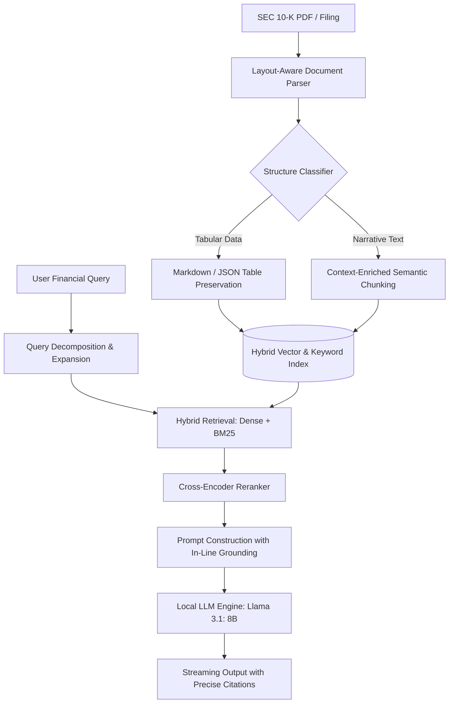

# Apple 10-K Insight: Private & Self-Hosted Financial RAG Engine

[](https://opensource.org/licenses/MIT)
[](https://github.com/meta-llama/llama-models)
[]()
[](https://www.python.org/)
[]()
[]()

A high-precision, privacy-first Retrieval-Augmented Generation (RAG) engine architected specifically for dense SEC filings and corporate financial disclosures. 

Powered entirely by a **self-hosted, local Llama 3.1: 8B model**, this system guarantees zero data leakage for compliance-heavy financial applications while tackling core RAG challenges: **multi-column table fragmentation**, **numerical hallucination**, and **multi-hop comparative reasoning**.

---

## 🚀 Key Features

* **100% On-Premise & Privacy-First:** Runs entirely on local infrastructure with zero third-party API dependencies, meeting enterprise banking and SEC compliance standards.
* **Optimized Local Inference:** Leverages Llama 3.1: 8B with prompt compression and local model serving (via Ollama / vLLM) for low-latency financial QA.
* **Structure-Aware Document Parsing:** Preserves multi-column financial tables, balance sheets, and footnote hierarchies without row-column truncation.
* **Hybrid Search Pipeline:** Combines dense vector retrieval (semantic context) with sparse BM25 indexing (exact financial tickers, account codes, and precise numbers).
* **Audit-Grade Citation Tracking:** Delivers precise page, item, and paragraph references for every synthesized metric, ensuring a verifiable audit trail.

---

## 🏗️ System Architecture



---

## 📊 Benchmark & Evaluation

Evaluated against standard naive RAG baselines on an Apple 10-K financial QA dataset using **Ragas** (evaluated locally):

| Metric | Baseline (Naive RAG) | This Engine (Llama 3.1: 8B) | Impact |
| :--- | :--- | :--- | :--- |
| **Faithfulness** | 0.65 | **0.91** | Eliminates fabricated numbers and hallucinated percentages |
| **Context Precision** | 0.59 | **0.86** | Pinpoints exact fiscal year entries and notes |
| **Answer Relevance** | 0.70 | **0.89** | Direct answers without extraneous boilerplate |
| **Data Privacy** | ❌ Sent to Cloud | **✅ 100% Local / Zero Egress** | Enterprise-grade security compliance |

---

## 🛠️ Tech Stack

* **Foundation LLM:** Llama 3.1 (8B Instruct) - Self-Hosted
* **Model Inference & Serving:** Ollama / vLLM
* **Backend Framework:** Python / FastAPI, Pydantic, Uvicorn
* **Orchestration:** LangChain / LlamaIndex
* **Vector Store & Retrieval:** ChromaDB / Qdrant, BM25, Local Cross-Encoder Reranker
* **Evaluation:** Ragas Framework

---

## ⚡ Quick Start

### 1. Prerequisites

Ensure you have [Ollama](https://ollama.com/) installed and pull the Llama 3.1 model:

```bash
ollama pull llama3.1:8b
ollama run llama3.1:8b
```

### 2. Clone & Setup Environment

```bash
git clone [https://github.com/sundogya/rag_apple_financial_report.git](https://github.com/sundogya/rag_apple_financial_report.git)
cd rag_apple_financial_report

python3 -m venv venv
source venv/bin/activate  # On Windows: venv\Scripts\activate
pip install -r requirements.txt
```

### 3. Configure Environment Variables

Create a `.env` file in the root directory:

```env
OLLAMA_BASE_URL=http://localhost:11434
MODEL_NAME=llama3.1:8b
EMBEDDING_MODEL=BAAI/bge-small-en-v1.5
VECTOR_STORE_PATH=./data/vector_store
```

### 4. Ingestion & Indexing

Process and index the Apple 10-K filing:

```bash
python scripts/ingest.py --input data/apple_10k_2023.pdf
```

### 5. Run API Server

```bash
uvicorn app.main:app --reload --port 8000
```

Interactive Swagger API docs available at `http://localhost:8000/docs`.

---

## 💬 Sample Inquiries Handled

* **Precise Metric Lookup:**  
  > *"What was Apple's total net sales breakdown across Americas, Europe, and Greater China for FY 2023?"*
* **Footnote & Accounting Analysis:**  
  > *"How does Apple account for its unrecognized tax benefits, and what was the balance at the end of the fiscal year?"*
* **Cross-Sectional Inference:**  
  > *"What are the primary operational risk factors related to manufacturing concentration mentioned in Item 1A?"*

---

## 📄 License

Distributed under the MIT License. See `LICENSE` for more information.
